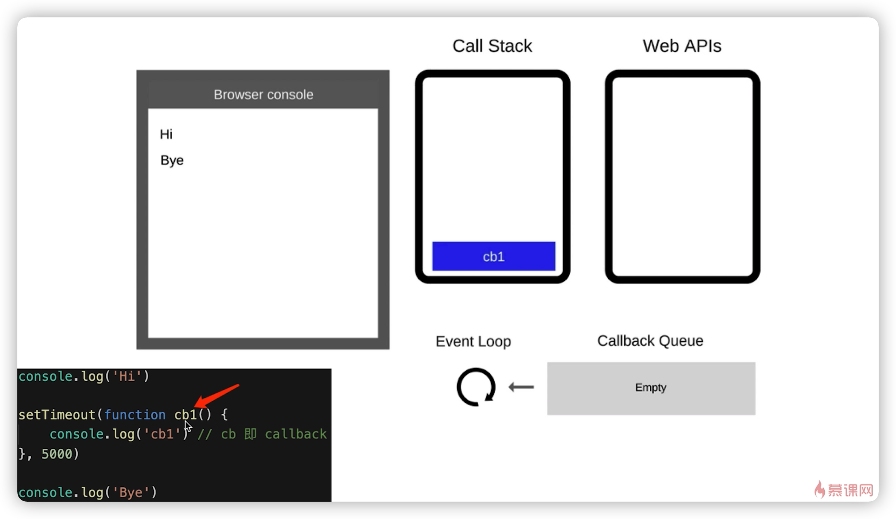

# JS异步 - 进阶 - 重点
## 题目
1. 请描述event lop(事件循环/事件轮询)的机制，可画图
2. 什么是宏任务和微任务，两者有什么区别
3. promise有哪三种状态？如何变化？
4. 场景题- promise then和catch的连接
## 1. event - loop(事件循环/事件轮询)
- JS是单线程 -> 异步要基于回调实现 -> event loop就是异步回调的实现原理
**event-loop概念**
```text
1. 同步代码，一行一行放在call Stack执行
2. 遇到异步，会’记录‘下，等待时机（定时、网络请求等）
3. 时机到了，就移动到Callback Queue
4. 如果Call Stack为空（即同步代码执行完）Event Loop开始工作
5. 轮询查找Callback Queue，如有则移动到Call Stack执行
6. 然后继续轮询查找（类似永动机）
```
```JS
console.log('Hi');

setTimeout(function cb1(){
    console.log('cb1'); // cb是cabllback
},5000)

console.log('Bye');
```





- DOM事件和event loop
  - JS是单线程的
  - 异步（setTimeout，ajax等）使用回调，基于event loop
  - DOM事件也使用回调，基于event loop
## 2. promise进阶
1. 三种状态
2. 状态的表现和变化
3. then和catch对状态的影响
## 3. async/await
## 4. 微任务/宏任务