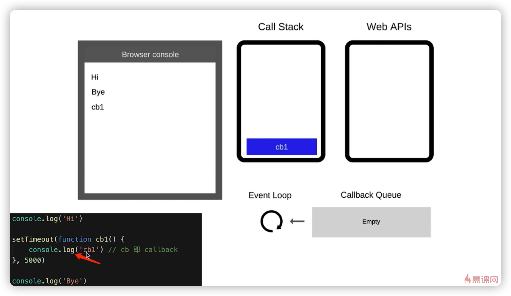

# JS异步 - 进阶 - 重点
## 题目
1. 请描述event lop(事件循环/事件轮询)的机制，可画图
2. 什么是宏任务和微任务，两者有什么区别
3. promise有哪三种状态？如何变化？
4. 场景题- promise then和catch的连接
## 1. event - loop(事件循环/事件轮询)
- JS是单线程 -> 异步要基于回调实现 -> event loop就是异步回调的实现原理
**event-loop概念**
```text
1. 同步代码，一行一行放在call Stack执行
2. 遇到异步，会’记录‘下，等待时机（定时、网络请求等）
3. 时机到了，就移动到Callback Queue
4. 如果Call Stack为空（即同步代码执行完）Event Loop开始工作
5. 轮询查找Callback Queue，如有则移动到Call Stack执行
6. 然后继续轮询查找（类似永动机）
```
```JS
console.log('Hi');

setTimeout(function cb1(){
    console.log('cb1'); // cb是cabllback
},5000)

console.log('Bye');
```





- DOM事件和event loop
  - JS是单线程的
  - 异步（setTimeout，ajax等）使用回调，基于event loop
  - DOM事件也使用回调，基于event loop
## 2. promise进阶
1. 三种状态
   1. pending、resolved、rejected
   2. pending -> resolved,pending -> rejected
   3. 状态变化不可逆
2. 状态的表现和变化
**状态变化**
```JS
const p1 = new Promise((resolve,rejected) => {

})

console.log('p1',p1);

const p2 = new Promise((resolve,rejected) => {
    setTimeout(() => {
        resolve()
    })
})

console.log('p2',p2); // pending 一开始打印时
setTimeout(() => console.log('p2-setTimeout',p2)); // resolved

const p3 = new Promise((resolve,rejected) => {
    setTimeout(() => {
        rejected()
    })
})
console.log('p3',p3);
setTimeout(() => console.log('p3-setTimeoout',p3)); // rejected
```
- **状态表现**
  - pending状态，不会触发then和catch
  - resolved状态，会触发后续的then回调函数， fulfilled
  - rejected状态，会触发后续的catch回调函数
```JS
const p1 = Promise.resolve(100); // fulfilled
// console.log('p1',p1);
p1.then(data => {
    console.log('data',data); // data 100
}).catch(err => {
    console.error('error',err)
})

const p2 = Promise.reject('err');
// console.log('p2',p2);
p2.then(data => {
    console.log('data2',data);
}).catch(err => {
    console.error('error2',err); // error2 err
})
```

3. then和catch对状态的影响
   1. then正常返回resolved，里面有报错则返回rejected
   2. catch正常返回resolved，里面有报错返回rejected
```JS
// then正常返回resolved，里面有报错则返回rejected
const p1 = Promise.resolve().then(() => {
    return 100;
})
console.log('p1',p1); // resolved 触发后续then回调
p1.then(() => {
    console.log('123'); // 执行then
})

const p2 = Promise.resolve().then(() => {
    throw new Error('new error')
})
console.log('p2',p2); // rejected 触发后续catch回调
p2.then(() => {
    console.log('456')
}).catch(err => {
    console.error('err100',err); // 执行catch
})

// catch正常返回resolved，里面有报错返回rejected
const p3 = Promise.reject('my error').catch(err => {
    console.error(err);
})
console.log('p3',p3); // resolved 注意 ，触发 then的回调
p3.then(() => {
    console.log(100);
})

const p4 = Promise.reject('my error').catch(err => {
    throw new Error('p4 error');
})
console.log('p4',p4); // rejected 触发 catch回调
p4.then(() => {
    console.log(200);
}).catch(() => {
    console.log('some error');
}) // resolved
```
### Promise题目解答
```JS
// > 第一题
Promise.resolve().then(() => {
    console.log(1) // 1
}).catch(() => {
    console.log(2)
}).then(() => {
    console.log(3) // 3
}) // resolved

// > 第二题
Promise.resolved.then(() => { // rejected
    console.log(1); // 1
    throw new Error('erro1')
}).catch(() => {
    console.log(2); // 2
}).then(() => {
    console.log(3); // 3
})

// > 第三题
Promise.resolve().then(() => { // rejected
    console.log(1); // 1
    throw new Error('error1');
}).catch(() => { // resolved
    console.log(2) // 2
}).catch(() => { // 这里是catch
    console.log(3)
})
```
## 3. async/await
## 4. 微任务/宏任务