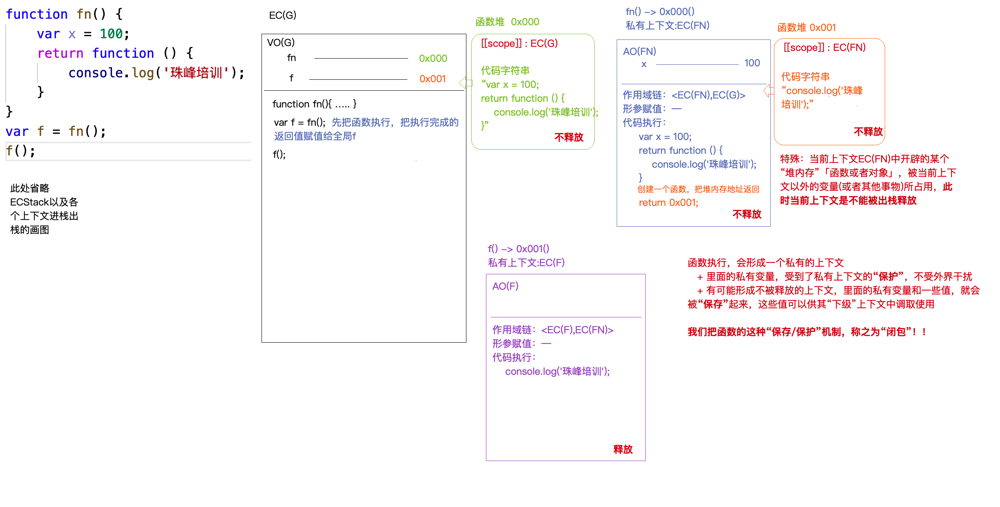

## 闭包
```JS
function fn() {
    var x = 100;
    return function () {
        console.log('codehzy')
    }
}
var f = fn();
f();
```
### 闭包特性

函数执行，会形成一个私有的上下文
+ 里面的私有变量，受到私有上下文的“保护”，不受外接干扰。
+ 有可能形成不被释放的上下文，里面的私有变量和一些值，就会被“保存”起来，这些值供其“下级”上下文中调取使用。
+ 我们把函数这种“保存/保护”机制，称之为“闭包”！！
