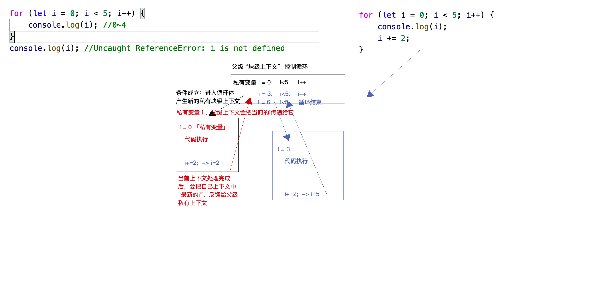

## let & const
### 变量声明
- 传统： var function
- ES6： let const import（模块导入）

> let VS const VS var
- let & const 区别
  - let声明一个变量，变量存储可以改值
  - const声明的一个变量，一旦赋值，则不能再和其他的值进行关联（不允许指针重新指向）
- 关于let和const，var
  - 1. 全局声明
    - let，const声明的变量会加到**全局变量**，但是**不会加入到window对象**中。而var会加入到全局变量和window对象中。
  - 2. 暂时性死区
    - let，const在声明前使用会出现**编译错误**，即整个代码都不执行。var则为undefined。
  - 3. 条件声明
    - let，const**不允许重复声明**一个变量，var的重复声明可以理解为覆盖。
  - 4. for循环中let声明
    - 会形成代码块，在for循环中，**使用let则for循环结束访问不到let声明的变量**，而var则是声明的全局的变量，不会形成块，因此var声明的变量可以在for循环外部访问到。
  - let,const变量不允许在**未声明**使用，var可以允许未声明使用。

